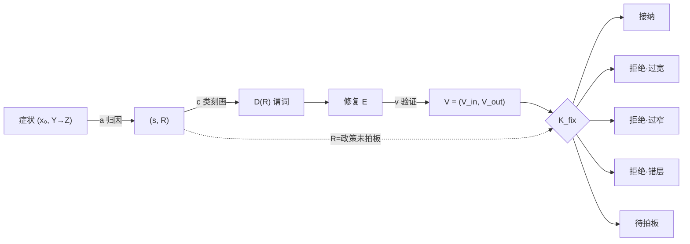

# 修复与泛化的数学抽象（修复演算 K_fix 与泛化边界）

> 状态：**草稿，待评审，未生效**。回答一个问题：对判定系统的一次"修复"，
> 什么时候真正解决了深层问题，什么时候只是补丁；以及"泛化"的合法提升路径只有哪几条。
> 记号体系独立于 `judge.md`，但归位表与其 §4/§5 对接。

## 1. 不变式内核 K_fix

设政策状态 \(P\)（代码 + 装配 + 已登记材料的整体），系统行为 \(B_P(x)\) 把输入案子
\(x\) 映为判定结论。发现症状：\(B_P(x_0) = Y\)，业务应为 \(Z\)。

- **修复** \(E\)：对 \(P\) 的一个增量，\(P' = P \oplus E\)。
- **影响集** \(\mathrm{Inf}(E) = \{x : B_{P\oplus E}(x) \neq B_P(x)\}\)——E 改变结局的全部输入。
- **根因** \(R\)：一个四值定位（§2 归因映射产出），
  \(R \in \{\)材料缺失, 材料错误, 消费违规, 政策未拍板\(\}\)。
- **缺陷类** \(D(R)\)：因 R 而错的输入全集，必须以**谓词**（内涵）写出，禁止用样本枚举代替。

内核签名（值域封闭穷尽，任何修复提案有唯一落点）：

```text
K_fix(R, D(R), E, V) → 接纳
                     | 拒绝·过宽   （Inf(E) ⊋ D(R)：误伤类外）
                     | 拒绝·过窄   （Inf(E) ⊊ D(R)：补症状，同类必复发）
                     | 拒绝·错层   （E 所在层 ≠ R 的归属层）
                     | 待拍板     （R = 政策未拍板：不存在工程解，路由到业务拍板）
```

接纳条件：\(\mathrm{Inf}(E) = D(R)\) 且 \(\mathrm{layer}(E) = \mathrm{owner}(R)\) 且证据 V 齐（§2 验证映射）。
K_fix 不关心 E 具体改了什么文件——它只消费 \(\mathrm{Inf}/D/\mathrm{layer}\) 三个投影。

## 2. 映射管线

```text
症状 (x₀, Y→Z)
  │ a  归因映射：把结论分解为子判断链，定位翻转结局的那一个子判断 s，
  │     并给出 R 的四值定位。s 层定位是强制的——R 不许写成"模型不行"这类全局散文。
  ▼
(s, R)
  │ c  类刻画映射：写出 D(R) 谓词（例："单条件裸词被收窄为字段语义的案子"）。
  ▼
D(R) ── E 设计（层由 R 定，见 §4 翻译规则）
  │ v  验证映射，产出证据 V = (V_in, V_out)：
  │     V_in  类内改善：D(R) 内抽样实判；
  │     V_out 类外不动：装配 diff——类外案子的判定输入逐字节不变（零 LLM 成本）。
  ▼
K_fix(R, D(R), E, V) → 五落点
```

时序约束：a 先于 c 先于 E 设计（先定位后动手）；V 在 K_fix 之前定格；
E 被拒绝后回到 a（怀疑 R 定位错），不许原地改 V 的口径。

## 3. 链路图

```text
(x₀,Y→Z) ──a──→ (s,R) ──c──→ D(R) ──→ E ──v──→ V ─┐
                  │                                ├─ K_fix ──→ 接纳 / 拒绝·过宽 / 拒绝·过窄 / 拒绝·错层
                  └────── R=政策未拍板 ────────────┘        └──→ 待拍板（出工程域）
```



## 4. 分层定理与泛化边界

**子判断二分**：结论链上的每个子判断 s 属于且仅属于——

- **推理闭合区**：结论由诉求字面 + 已登记材料 + 世界事实决定（如：私加条件、值改写、
  枚举归一）。此区内判定者天然泛化，新类不需要新供给。
- **政策依赖区**：结论依赖业务的自由选择（如：裸词收窄的宽严、区间边界含不含端点、
  职责圈多大）。此区内**不存在推理意义上的泛化**——任何判定者（人类专家同理）
  在未拍板的政策自由度上输出的都是噪声，不是判断。

**泛化边界定理**：泛化半径 = 推理闭合区 ∪ 已拍板政策区。
提升泛化只有两条合法路径：
(1) 给推理闭合区补齐可引用材料（扩大可判范围）；
(2) 把政策自由度以**原则**拍板——原则覆盖开放类（一条"语义不确定的裸词不得被
收窄为字段语义，除非该读法有独立依据"覆盖姓名/业务词/地名/未来的未知裸词类），
逐 case 规则不合法（它是 \(\mathrm{Inf} \subsetneq D\) 的过窄修复）。

**翻译规则**（对接 judge.md §4）：R 的层归属决定 E 的落点——材料缺失/错误 → 材料层
（登记/修正，戳记入 G）；消费违规 → 装配或协议层；政策未拍板 → 不产生 E，产生拍板请求。
prompt 补丁绕过该翻译，结构上不可审计 \(\mathrm{Inf}(E)\)，一律拒绝·错层。

## 5. 既有机制归位

| 机制 | 归位 |
|---|---|
| 冻结回归集（name pack / iteration badcases） | V_in 的抽样库；不是 D(R) 的定义（枚举 ≠ 内涵） |
| 装配指纹比对（本轮消融方法） | V_out 的执行器：类外逐字节不变 ⇒ 类外判定分布不变 |
| `check-name-principle.md` 业务单元格 | 政策拍板记录（未登记形态；待升格为已拍板政策区成员） |
| field_sufficiency 姓氏闸 | 原则的确定性载体（供事实，不下三态；当前 hint 形态即此归位） |
| 0814 prompt 裸词规则（已删） | 拒绝·过宽的存档反例（\(\mathrm{Inf} \supsetneq D\)：误杀真名） |
| 0816 删规则动作 | 同为过宽（反向）：\(\mathrm{Inf}\) 覆盖全部裸词类而 R 只在标准缺位 |

## 6. 纪律的对偶面

K_fix 不看 E 的实现，恰恰因为三个投影把可问责性带在身上：
\(D(R)\) 是谓词故可审计覆盖；\(\mathrm{Inf}(E)\) 由装配 diff 结构性给出而非声称；
layer 由 R 四值确定性路由。缺任一投影 → 诚实的"证据不齐"，退回管线，
不是靠散文说服。政策未拍板时，判定侧的诚实落点是"说不清 + 缺的是哪个拍板"，
把选择留给业务，不许判定者用世界常识的置信度冒充业务政策。

## 7. 演化含义

- 修复请求的入口形态从"改哪里"变为"交 (R, D(R), E, V) 四元组"；评审只运行 K_fix。
- 政策未拍板的显影（待拍板落点的积压清单）是业务治理的输入，不是工程债。
